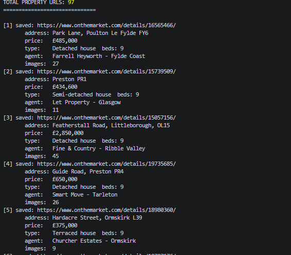

# onTheMarket-scraper

This is a scraper tool for onTheMarket.com a real estate website which contains a huge amount of property in the UK

## Setup Instructions

### Cloning Repo

git clone https://github.com/CoDeBrEaKe/onTheMarket-scraper.git

### Download dependencies

npm install

### Usage

you can run the scraper with this command
npm start
or
node scraper.js

## Database Schema

    url         TEXT UNIQUE NOT NULL,
    address     TEXT,
    price       TEXT,
    type        TEXT,
    beds        INTEGER,
    description TEXT,
    agent       TEXT,
    images      TEXT,
    scraped_at  DATETIME DEFAULT CURRENT_TIMESTAMP

## Output sample

this shows the logger that logs every detected property and small part of its details

